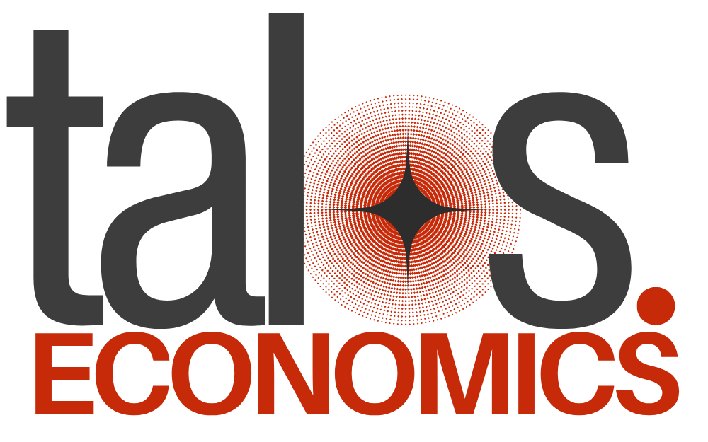

Talos Engine is accelerated economics for Python. It provides fast, flexible tools for building and simulating agent-based economic models, with planned support for large-population modelling, abstract simulations with LLMs, and more. 

Since it is being developed as I study economics myself, it is likely to be opinionated and focused on the areas I find interesting, but I welcome contributions and suggestions!

Please see `/book/notes.md` for running notes on what I'm working on right now. Talos aims to be an **engine** for economic simulations, and in the future, the idea is to have LLMs as surrogate agents in the market taking abstract decisions at scale, but for now, the focus is on building a solid foundation for determinstic agent-based economic simulations. 

