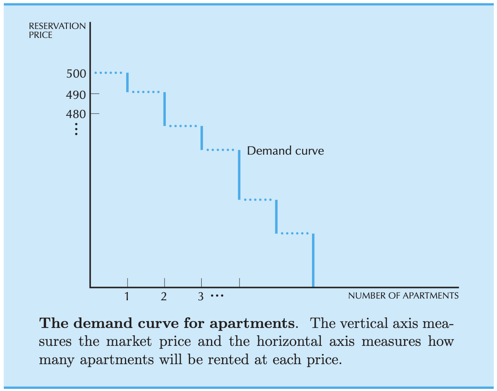

A model's power stems from the elimination of irrelevant detail. 

Imagine: price of apartments -- simplified description of the mpartment market. 

Right simplification: simplest model capable of describing economic situation. 
Then, add complications one at a time until we hit realism. 

>  wisprflow for ntoes from textbook?

case study:

market for apartments in a medium-size midwestern college twon: two sorts of apartments: 

some adjacent to the uni, some further away. 
Closeby: more favourable- - -easier access to uni; the others are worse.

Let's consider the paartments in two large rings, surrounding the university.
Adjacent apartments: inner ring, rest: outer ring.

Focus exclusively on **market for apartments in inner ring**

outer ring: people can go if they dont find any of the inner ring apartments.

Based on this, we'll determine the price of the inner-ring apartments.

DEF: exogenous variable:  prescribed by forces NOT present in the model.
eg: outer ring apartments.
DEF: endogenous variable: prescribed by forces present in the model.
eg: inner ring apartments.

Simplification 1: all apartments are identical, other than location. 
Makes sense: we don't have to talk about one, two, three bedrooms. 

Questions for our model to answer:

Q1: what determines the price of these endogenous apartments?
Q2: yes/no: inner apartment, or outer apartment, and who?
Q3: "what can be said about the desirability of different economic mechanisms for allocating apartments?" [?]
Q4: What concepts to judge the merit of different assignments of apartments to individuals?

Two simple principles:
DEF: optimization principle:
People will try to choose the best pattern of consumption they can afford.
DEF: equilibrium princople:
Prices will adjust until the amount that people demand of something is equal to the amount of supply -- i.e, equilibrium is reached, how is measured though?

first is nearly tautological: notice this; we assume that people know what they want, basically. and are efficient players.

equilibrium is tricky, and it might go up down woozy to get to a price that works, and it may destabilize the system via other changes it causes -- usually, doesn't happen. rent prices usually stabilize.

equilibrium is not always defined in the same way across models: but typically, requirement is this: economic agents' actions == consistent with each other.

## demand curve

Consider this:
Assume we do a survye of all the people willing to rent the apartment.
Someone must be willing to pay the highest price. >> this seems to be a good pivot for starting the analysis. 

Start at the top: someone must be willing to pay the highest price. Doesn't want to walk far. Says USD 500.

If there is only one person willing to pay the USD 500, then if rent is $500, (and by equilibrium we assume the rent has settled already[?]), then only 1 person will rent an apartment. 

Let's say the next highest bid is for $490: price goes down 500, 499, ..., 491, 490 -- and we have two people willing to pay, and so on. pretty simple. 

DEF: reservation price: maximum price someone is willing to pay for a good.
highest price that a GIVEN PERSON will accept and still purchase the good. At reservation price p, they will be *indifferent* to living in the inner ring and paying p, versus just living in the outer ring ([?] at what cost? Does that matter, perhaps it's the delta?)

in the limiting case of apartments with many demanders (what about LOTS of apartmetns, few demanders [?]), jumps between prices will be small. in that case

## supply curve.
DEF: competitive market: situation where lots of independent landloards are trying to outbid each other: they will rent out apartment to the highest price the market will bear. (what is the metric of "how close to competitive" a market is? [?])

Consider high price, $p_h$, and low price $p_l$. 

Consider the number of apartments to be roughly fixed, over a short span of time. The short span of time is an important assumption. Supply, then is a fixed line. In the reservation price / no of apartments, it's a vertical line. 

I think it's better to look at in terms of the no of apartments / reservation price, in which case it'll be a horizontal line.

Now, what it seems is that we want to look at *movement*: which person is the likeliest to move the stability of the system? Makes sense to look at the people renting the apartments for a high price ([?] is there some sort of satisfiability criterion that makes them want to move?)

Anyway, wherever this supply/demand curve meets is the correct location for the equilibrium.

Let's try to write it mathematically. 

Let $A$ be number of apartments. Then, $\frac{dA}{dt} = 0$, and $A(p) = p_0$, where $A(\cdot)$ is a function of *reservation price*, $p$ and $p_0$ is a constant. Also, demand is inversely proportional to the reservation price; hence, we say $D(p) = \frac{k}{p}$, $k$ is a cosntant. 

We want to see where $p$ will stabilize. For some reason this is where $\frac{k}{p} = p_0$, solve for $p$. This means $D(p) = A(p)$ -- i.e, demand = supply. Why?

There has to be some mathematical way to encode the idea of this equilibrium. 
Somewhere, the derivative has to turn to zero, and then the demand = supply there. 
That's what equilibriums are [?]

----
Marginal utility as the source of price. 
Independently discovered by <Jevons>, <Menger>, <Walras> in 1870s.

----
